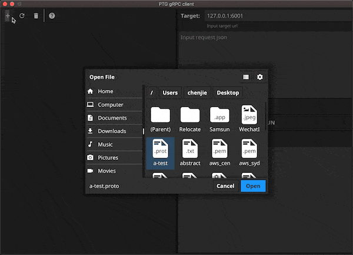

# ptg
Performance testing tool (Go), It is also a **GUI** `gRPC` client.

Test the `gRPC` service like `postman`.




# Install

## cli app
```go
go get github.com/crossoverJie/ptg
```

```shell script
wget https://github.com/crossoverJie/ptg/releases/download/${version}/ptg-${os}-${version}.tar.gz
```

## GUI app

To download the installer, go to the [Releases Page](https://github.com/crossoverJie/ptg/releases).

## Build from source

```shell
git clone git@github.com:crossoverJie/ptg.git
cd ptg
make release
make pkg-win
make pkg-macos
```


# Usage

```shell script
NAME:
   ptg - Performance testing tool (Go)

USAGE:
   ptg [global options] command [command options] [arguments...]

COMMANDS:
   help, h  Shows a list of commands or help for one command

GLOBAL OPTIONS:
   --thread value, -t value              -t 10 (default: 1 thread)
   --Request value, --proto value        -proto http/grpc (default: http)
   --protocol value, --pf value          -pf /file/order.proto
   --fully-qualified value, --fqn value  -fqn package.Service.Method
   --duration value, -d value            -d 10s (default: Duration of test in seconds, Default 10s)
   --request value, -c value             -c 100 (default: 100)
   --HTTP value, -M value                -m GET (default: GET)
   --bodyPath value, --body value        -body bodyPath.json
   --header value, -H value              HTTP header to add to request, e.g. "-H Content-Type: application/json"
   --target value, --tg value            http://gobyexample.com/grpc:127.0.0.1:5000
   --help, -h                            show help (default: false)
```
## http
```shell script
ptg -t 20 -d 10 -proto http -tg "http://gobyexample.com"
```

Benchmark test for 10 seconds, using 20 goroutines.

output:
```shell script
Requesting: http://gobyexample.com  <---------------> 1 p/s 100.00%

43 requests in 10 seconds, 13.88MB read.
Avg Req Time:           358.512071ms
Fastest Request:        93.518704ms
Slowest Request:        840.680771ms
Number of Errors:       0
```

## gRPC(unary call)

```shell script
ptg -t 10 -c 100 -proto grpc  -pf /xx/xx.proto -fqn hello.Hi.Say -body test.json  -tg "127.0.0.1:5000"
```

output:
```shell script
thread: 10, duration: 0, count 100
Requesting: 127.0.0.1:5000  <---------------> 102 p/s 100.00%
100 requests in 11 seconds, 230.6kB read, and cost 1 second.
Avg Req Time:           116.602652ms
Fastest Request:        111.563179ms
Slowest Request:        128.587886ms
Number of Errors:       0
```


# TODO

- [x] cli support.
- [x] GUI support.
- [ ] metadata support.
- [ ] benchmark GUI.